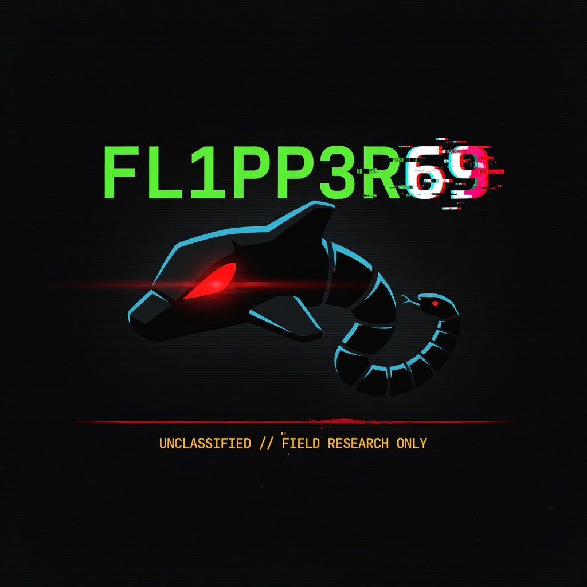

[](assets/fl1pp3r69-hero.png)

# Fl1pp3r69

**The dolphin grew teeth.**  
**The veil still holds. Argus opens every eye.**

Manifest-driven Flipper Zero field ops — Momentum base, CASEFILE discipline, chain-of-custody from pocket to desktop.


`10 FAPs · v4.0.0` · `CLAIM harness` · `schema v4` · `desktop seal + dashboard`

## What is this

Stock Flipper apps capture signals. **Fl1pp3r69 captures signals inside an operation** — named, phased, hashed, claimable, and report-ready.

**Pipeline:** `INTAKE → OP_PREP → PROBE → CAPTURE → VERIFY → EXFIL → CLOSE`

## Suite (ARGUS VEIL)

| Codename | FAP | Role |
|----------|-----|------|
| CASEFILE | flipper69_casefile_ops | Hub + CLAIM + recovery |
| DEWDROP | flipper69_probe_nfc | NFC custody |
| DAMP_CROWD | flipper69_probe_subghz | Sub-GHz meta |
| EMBER_TRACE | flipper69_probe_ir | IR meta |
| LODGE | flipper69_probe_rfid | LF RFID meta |
| BITKEY | flipper69_probe_ibutton | iButton meta |
| HAZE | flipper69_probe_ble | BLE passive meta |
| GPIO LAB | flipper69_probe_gpio | GPIO lab meta |
| INKWELL | flipper69_probe_badusb | BadUSB lab meta (gated notes) |
| crypttool+ | flipper69_manifest_viewer | Manifest browser |

## Quick start

### FAPs

```powershell
py -m pip install --upgrade ufbt
.\scripts\build-fap.ps1 -App all
```

Copy `dist/*.fap` to SD `apps/` (NFC probe under `apps/NFC/`).

### Desktop

```bash
pip install -e ./desktop
python -m flipper69 sync --sd ./examples/sd_card
python -m flipper69 migrate
python -m flipper69 seal op-20260711-veil-ledger-demo
python -m flipper69 audit
python -m flipper69 dashboard
```

### CLAIM

On device: CASEFILE → **[3] CLAIM ARTIFACT** imports the largest recent file from stock Sub-GHz / NFC / IR / LF RFID / iButton folders into the active op and writes claim meta. Then VERIFY.

## Ethics

1. Field captures and metadata only — no exploit code  
2. Authorized research on owned hardware only  
3. No jamming / region bypass / ungated bruteforce  
4. Panic wipe = operation metadata only  
5. Deliberate exfil only  

## Docs

- [VISION-v4](docs/VISION-v4.md) · [AUDIT-v3](docs/AUDIT-v3.md) · [DESIGN](docs/DESIGN.md)
- [OPS-DISCIPLINE](docs/OPS-DISCIPLINE.md) · [MIGRATION-v4](docs/MIGRATION-v4.md)
- [SECURITY](SECURITY.md) · [CONTRIBUTING](CONTRIBUTING.md)

## Support the work

Fl1pp3r69 is **free and open source**. Bug reports and feature requests are welcome via [GitHub Issues](https://github.com/Pitchfork-and-Torch/Fl1pp3r69/issues).

---

MIT License · Field research on owned hardware · Do not publish exploit derivatives  

**The dolphin grew teeth. The veil still holds. Argus opens every eye.**
