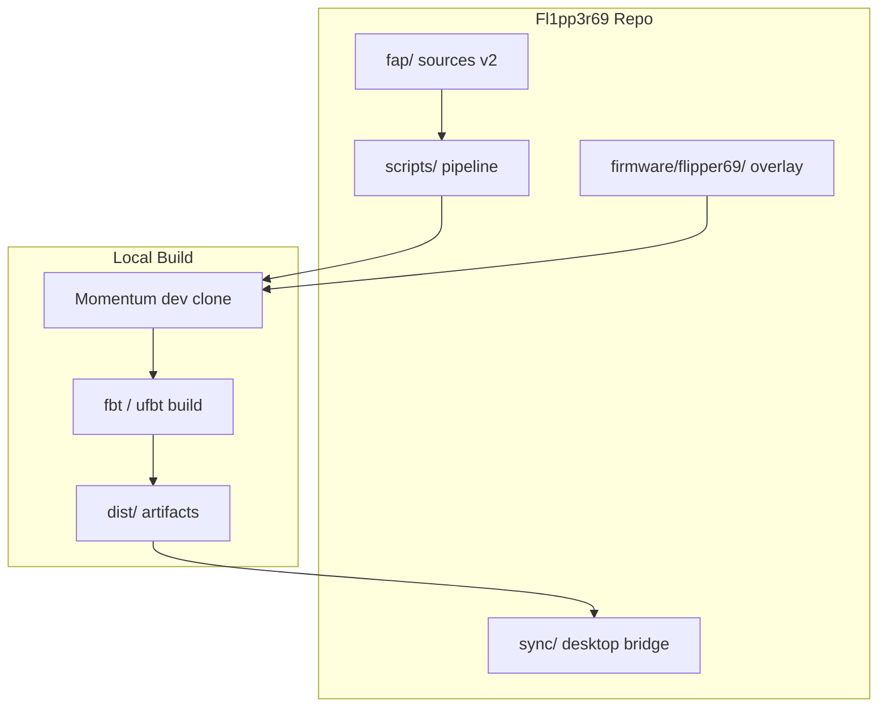
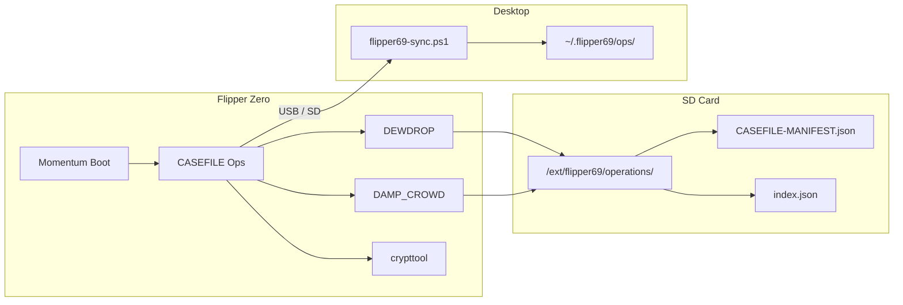
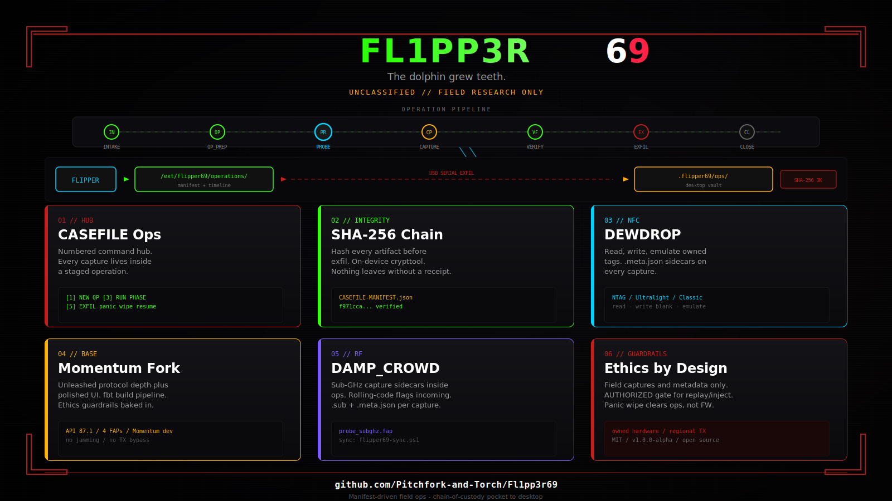

<p align="center">
  
</p>

<h1 align="center">Fl1pp3r69</h1>

<p align="center">
  <strong>The dolphin grew teeth.</strong><br>
  Manifest-driven Flipper Zero field ops — Momentum base, CASEFILE discipline, chain-of-custody from pocket to desktop.
</p>

<p align="center">
  
  
  
  
</p>

<p align="center">
  <code>4 FAPs · v2.0.0</code> · <code>API 87.3</code> · <code>SHA-256 manifest chain</code> · <code>phase HUD</code>
</p>

```
╔══════════════════════════════════════════════════════════╗
â•‘  FL1PP3R69 // CASEFILE OPS              v2.0.0          â•‘
║  ──────────────────────────────────────────────────────  ║
â•‘  [1] NEW OPERATION    [5] EXFIL TO DESKTOP                â•‘
â•‘  [3] RUN PHASE        [7] OPSEC TOGGLE                    â•‘
║  [I][P][B][C][V][E][X]   MANIFEST ✓   OPSEC              ║
╚══════════════════════════════════════════════════════════╝
```

---

## Contents

- [What's new in v2](#whats-new-in-v2)
- [What makes this different](#what-makes-this-different)
- [The suite](#the-suite)
- [Operation pipeline](#operation-pipeline)
- [Quick start](#quick-start)
- [DEWDROP — NFC](#dewdrop--nfc-in-plain-english)
- [Desktop bridge](#desktop-bridge)
- [Identity & boot](#identity--boot)
- [Project map](#project-map)
- [Roadmap](#roadmap)
- [Ethics](#ethics)
- [Docs](#docs)

---

## What's new in v2

> **Product polish.** Same ethics surface, sharper instrument — HUD, op-type flow, dual-confirm panic, SD import, full version alignment.

| Area | v2 upgrade |
|------|------------|
| **CASEFILE UI** | Glitch splash, phase strip I·P·B·C·V·E·X, footer OPSEC badge, status toasts |
| **Create flow** | Op type → PATHNUM → seal (with hints) |
| **Panic** | Two-step ARM → CONFIRM DESTRUCT |
| **Engine** | `index.json`, notes scaffold, capture counts, proper manifestHash JSON |
| **DEWDROP** | Ownership gate chrome, LIVE RF frame, ISO meta timestamps |
| **DAMP_CROWD** | Band menu (433 / 315 / 868 / generic) timestamped sidecars |
| **crypttool** | Multi-op browse, item counts, VERIFIED badge |
| **Desktop** | SD import + hash verify, banner, ping/pong |
| **Version** | **2.0.0** end-to-end (FAP, timeline, theme, MANIFEST) |



---

## What makes this different

Stock Flipper apps capture signals. **Fl1pp3r69 captures signals inside an operation** — named, typed, phased, hashed, and exfil-ready. No sprawl. No mystery files on your SD card. Every artifact gets a receipt.

| Everyone else | Fl1pp3r69 |
|---------------|-----------|
| Random `.sub` / `.nfc` in folders | Staged ops under `/ext/flipper69/operations/` |
| "I think I saved that Tuesday?" | `TIMELINE.jsonl` + `CASEFILE-MANIFEST.json` + `index.json` |
| Hope the file didn't change | SHA-256 before exfil |
| 200 menu items, no workflow | Numbered CASEFILE hub → probe plugins |
| Generic CFW plugin soup | Momentum power, your ethics guardrails |

**Base firmware:** [Momentum](https://github.com/Next-Flip/Momentum-Firmware) — Unleashed protocol depth, polished UI, rolling-code flags.  
**Your layer:** CASEFILE ops, manifest chain, DEWDROP NFC, desktop sync, obsidian/red identity.

### What it is

| Layer | Role |
|-------|------|
| **CASEFILE Ops** | Manifest-driven hub — numbered menu, staged phases, dual-confirm panic wipe |
| **Probe plugins** | Sub-GHz, NFC — each writes SHA-256-ready `.meta.json` sidecars |
| **Desktop sync** | USB serial exfil **or** SD import with manifest verification |
| **Firmware skin** | Glitch boot, viper dolphin, obsidian/red theme *(overlay staged)* |

### What it is not

- Not a network exploitation platform — no WiFi, no kernel tools
- Not a general-purpose attack framework
- Not legal advice — authorized research on owned hardware only

### New here? Start in 60 seconds

1. Build FAPs → copy to SD → open **CASEFILE Ops**
2. **[1] NEW OPERATION** → type → pathnum → run phases
3. **DEWDROP** reads your hotel key / Amiibo / access card → saves to the op folder
4. **VERIFY** hashes everything → **EXFIL** pushes to your PC (or pull SD + `-SdImport`)

No device yet? Simulate an op on desktop:

```powershell
cd sync
.\new-field-op.ps1 -OpType unified -Label "garage-test" -Pathnum ds
.\flipper69-sync.ps1 -SdImport ..\examples\sd_card
```

---

## The suite

| Codename | FAP | Role |
|----------|-----|------|
| **CASEFILE Ops** | `flipper69_casefile_ops` | Command hub — new/resume op, run phases, verify, exfil, panic wipe |
| **DEWDROP** | `flipper69_probe_nfc` | NFC read · write · emulate with `.meta.json` sidecars |
| **DAMP_CROWD** | `flipper69_probe_subghz` | Sub-GHz band sidecar (use stock Sub-GHz for raw capture) |
| **crypttool** | `flipper69_manifest_viewer` | On-device multi-op hash viewer |



---

## Operation pipeline

Every field session follows the same spine:

```
INTAKE → OP_PREP → PROBE → CAPTURE → VERIFY → EXFIL → CLOSE
```

| Phase | What happens |
|-------|----------------|
| **INTAKE** | Name the op (auto codename), pick type + PATHNUM |
| **OP_PREP** | Generate `opId`, write `OPERATION.json` + `notes.txt`, OPSEC on |
| **PROBE** | Launch DEWDROP, DAMP_CROWD, or stock domain apps |
| **CAPTURE** | Raw + parsed files land in `captures/` |
| **VERIFY** | SHA-256 everything → `CASEFILE-MANIFEST.json` |
| **EXFIL** | USB serial JSON-lines **or** SD pull |
| **CLOSE** | Seal op, update `index.json`, append timeline |

Replay and inject phases expect explicit authorization. Panic wipe clears op metadata — not base firmware. **Two OK presses** to arm then wipe.

### Gestures

| Input | Where | Action |
|-------|-------|--------|
| Right / long Left | Main menu | Live status toast |
| OK on EXFIL | Exfil screen | Seal CLOSE |
| OK ×2 | Panic | ARM → wipe |

---

## Quick start

### Path A — FAPs only (fastest)

Works on stock, Unleashed, or Momentum firmware.

```powershell
py -m pip install --upgrade ufbt
.\scripts\build-fap.ps1 -App all
```

Copy from `dist/` to SD:

| File | SD path |
|------|---------|
| `flipper69_casefile_ops.fap` | `apps/` |
| `flipper69_probe_nfc.fap` | `apps/NFC/` |
| `flipper69_probe_subghz.fap` | `apps/` |
| `flipper69_manifest_viewer.fap` | `apps/` |

Open **CASEFILE Ops** on the device. You're in.

### Path B — Full Momentum fork

```powershell
.\scripts\init-firmware-fork.ps1
.\scripts\sync-faps-to-firmware.ps1
.\scripts\apply-flipper69-patches.ps1
.\scripts\build-firmware.ps1 -Target all
```

Flash `dist/firmware/flipper-z-f7-update-mntm-dev-*.tgz` via qFlipper, then deploy FAPs.

### Path C — Desktop sync

```powershell
# USB serial (device: [5] EXFIL TO DESKTOP)
.\sync\flipper69-sync.ps1 -ComPort auto

# Or bulk-import from SD after a field day
.\sync\flipper69-sync.ps1 -SdImport E:\
```

Files land under `%USERPROFILE%\.flipper69\ops\`.

### Health check

```powershell
$env:FLIPPER_PORT = "auto"
python .\scripts\flipper-healthcheck.py
```

---

## DEWDROP — NFC in plain English

1. **Read** — hold tag to Flipper → standard `.nfc` saved to your op folder  
2. **Write** — load saved file → confirm ownership → write to blank NTAG / Ultralight / Classic  
3. **Emulate** — present saved tag to phones, readers, arcade cabinets  

| Tag type | Read | Write blank | Emulate |
|----------|------|-------------|---------|
| NTAG / Ultralight | ✓ | ✓ | ✓ |
| MIFARE Classic 1K/4K | ✓* | ✓* | ✓ |
| ISO14443-A UID-only | ✓ | magic card | ✓ |
| ST25TB | ✓ | ✓ | ✓ |

\*Partial read if keys unknown. Bank cards, DESFire, and secure-element fobs are **not** full-clone targets — by design. iPhones and Android phones are **readers**, not blank writable tags — use **Emulate** instead.

---

## Desktop bridge

```powershell
.\sync\flipper69-sync.ps1              # auto COM
.\sync\flipper69-sync.ps1 -Once        # one op then exit
.\sync\flipper69-sync.ps1 -SdImport X:\  # verify + vault
.\sync\new-field-op.ps1 -OpType survey -Label lab -Pathnum imps
```

Protocol types: `op_header`, `manifest`, `artifact`, `op_close`, `ping`/`pong`.

---

## Identity & boot

**Viper dolphin** — stock Flipper silhouette evolved. Tail splits into three viper coils. One eye: horizontal red slit. Not cute. *Aware.*

```
FRAME 0-3   noise burst
FRAME 5,9   scanline tear
FRAME 6-12  FL1PP3R + 69
FRAME 13+   blood rule · classification · VER=2.0.0
FRAME 20+   tagline blink · viper eye
```

Spec: [`assets/boot_anim.txt`](assets/boot_anim.txt) · Mascot: [`assets/mascot_spec.md`](assets/mascot_spec.md) · Theme: [`firmware/flipper69/theme/flipper69.json`](firmware/flipper69/theme/flipper69.json)

---

## Project map

```
Fl1pp3r69/
├── fap/                    # Canonical FAP sources (4 apps @ v2)
├── dist/                   # Built .fap + BUILD_MANIFEST.json
├── firmware/
│   └── flipper69/          # Overlay patches, theme, MANIFEST.json
├── scripts/
│   ├── build-fap.ps1
│   ├── build-firmware.ps1
│   ├── init-firmware-fork.ps1
│   ├── sync-faps-to-firmware.ps1
│   └── flipper-healthcheck.py
├── sync/                   # Desktop exfil + new-field-op + SD import
├── schemas/                # OPERATION + manifest JSON schemas
├── docs/
│   ├── DESIGN.md
│   ├── OPS-DISCIPLINE.md
│   └── superpowers/specs/
└── assets/                 # Hero, boot anim, mascot, infographic
```

---

## What we inherit vs what we ship

| From Momentum / Unleashed | Fl1pp3r69 unique |
|---------------------------|------------------|
| Extended Sub-GHz protocols | CASEFILE staged ops + phase HUD |
| NFC parsers & rolling-code flags | SHA-256 manifest chain + index |
| Themes, clock, pin lock, BadKB shell | USB + SD desktop bridge |
| Polished desktop UX | DEWDROP read/write/emulate |
| | Obsidian/red identity + OPSEC defaults |
| | Viper dolphin + glitch boot |

**Explicitly excluded:** jamming packs, TX region bypass, ungated bruteforce, exploit binaries.

---

## Roadmap

| Version | Status |
|---------|--------|
| v0.1–v0.3 Scaffold + DEWDROP | ✓ |
| v1.0-alpha Momentum fork + fbt | ✓ |
| **v2.0.0 Product polish** | ✓ **you are here** |
| P2 Boot → CASEFILE Ops autostart | ◻ |
| P3 Full theme pack assets on device | â—» |
| P4 Serial exfil service in firmware | â—» |
| v2.1 Rolling-code flags in DAMP_CROWD | â—» |

---

## Security

See [SECURITY.md](SECURITY.md) for scope, safe use, and reporting.

---

## Ethics

1. **Field captures and metadata only** — no exploit code in repo or on SD  
2. **AUTHORIZED** gate for replay / inject  
3. **Regional TX** respected — no region-bypass patches  
4. **Panic wipe** clears op metadata, not firmware  
5. **Authorized research on owned hardware** — not legal advice  

---

## Docs

- [`docs/DESIGN.md`](docs/DESIGN.md) — architecture  
- [`docs/OPS-DISCIPLINE.md`](docs/OPS-DISCIPLINE.md) — phase reference  
- [`CHANGELOG.md`](CHANGELOG.md) — full history  
- [`release-notes-v2.0.0.md`](release-notes-v2.0.0.md) — this release  
- [`firmware/flipper69/README.md`](firmware/flipper69/README.md) — Momentum overlay  

---

## Support the work

Fl1pp3r69 is **free and open source**. Bug reports and feature requests are welcome via [GitHub Issues](https://github.com/Pitchfork-and-Torch/Fl1pp3r69/issues).

---

<p align="center">
  
</p>

<p align="center">
  <sub>MIT License · Field research on owned hardware · Do not publish exploit derivatives</sub><br><br>
  <strong>The dolphin grew teeth. The manifest keeps the bite legal.</strong>
</p>
