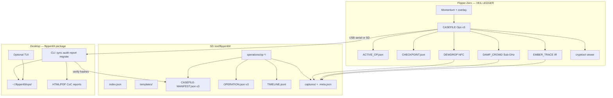
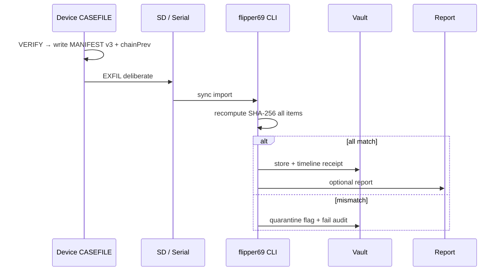

# Fl1pp3r69 v3.0 — Vision & Roadmap

**Codename:** **VEIL LEDGER**  
**Tagline evolution:** *The dolphin grew teeth. The veil hides the op. The ledger never lies.*  
**Classification:** UNCLASSIFIED // FIELD RESEARCH ONLY  
**Baseline:** v2.0.0 (2026-07-09)  
**Target:** v3.0.0  
**Date:** 2026-07-11

---

## 1. Executive Summary

v2.0.0 shipped a disciplined, ethics-bound CASEFILE instrument: staged phases, SHA-256 manifests, dual-confirm panic, DEWDROP / DAMP_CROWD probes, and a PowerShell exfil bridge. That foundation is sound.

**v3.0 VEIL LEDGER** does not rewrite the spine. It **deepens the ledger** (richer integrity model, recovery, multi-session continuity), **raises the veil of analysis** (first-class desktop toolkit: audit, timeline, chain-of-custody reports), and **opens a gated extension surface** (probe plugin descriptors + templates) so contributors can add capture domains without eroding OPSEC or introducing exploit surface.

| Stakeholder | What v3 delivers |
|-------------|------------------|
| Solo field researcher | Active-op pointer, power-loss checkpoints, IR probe sidecar, faster resume |
| Red team / physical pentester | PDF/HTML reports with embedded hashes, template ops, client-ready CoC sections |
| Academic / investigator | Schema v3 provenance, device binding, migration-safe vault history |
| Maintainer / contributor | Probe plugin contract, CI (schema + desktop), scaffolding docs |
| Compliance / legal | Explicit authorization gates, immutable-style chain fields, export retention notes |

**Non-negotiables preserved:** Manifest everything · Staged workflow only · Zero exploits / jamming / region bypass · Deliberate exfil · OPSEC defaults · User bears legal responsibility.

---

## 2. Codename & Thematic Direction

### VEIL LEDGER

| Element | Meaning |
|---------|---------|
| **Veil** | OPSEC: BT off, classification banners, panic wipe of metadata, air-gapped defaults |
| **Ledger** | Every artifact is an entry; SHA-256 + optional `chainPrev` links verifications across sessions |
| **Visual** | Same obsidian/red/viper-dolphin language; ledger motif in desktop chrome (hash ticks, phase rail) |
| **Release line** | `FL1PP3R69 // VEIL LEDGER // v3.0.0` |

Alternate names considered and rejected for this release: *Viper's Chain* (too aggressive), *Phantom Codex* (less audit-forward), *Abyss Manifest* (less professional for client reports).

---

## 3. Multi-Angle Analysis

### 3.1 Solo field researcher

| Need | v2 gap | v3 answer |
|------|--------|-----------|
| Speed under pressure | Manual latest-op discovery in probes | `ACTIVE_OP.json` pointer + resume HUD |
| Reliability | Power loss mid-phase loses context | `CHECKPOINT.json` + phase recovery on boot of hub |
| Environment variety | Sub-GHz + NFC only as first-class | **EMBER_TRACE** IR probe (sidecar) |
| Air-gap | PS1 serial + SD import | Python CLI works offline; SD is first-class path |

### 3.2 Professional red team

| Need | v2 gap | v3 answer |
|------|--------|-----------|
| Client audit trail | Manifest exists; report is DIY | `flipper69 report` HTML/PDF with CoC + hashes |
| Repeatable SOW ops | Ad-hoc INTAKE | Operation **templates** (`survey-building`, `badge-lab`, …) |
| Multi-day engagement | Single phase stream | Multi-session ops (`session` counter + timeline continuity) |

### 3.3 Academic / independent investigator

| Need | v2 gap | v3 answer |
|------|--------|-----------|
| Provenance | Hash list | `schemaVersion`, `deviceId`, `verifyCount`, `chainPrev` |
| Publication defense | Manual notes | Timeline export + notes in report appendix |
| Legal hold | No retention tooling | Vault export packages + retention advisory docs |

### 3.4 Maintainer / contributor

| Need | v2 gap | v3 answer |
|------|--------|-----------|
| Safe extensibility | Hard-coded probes | `probe.plugin.json` contract + ethical contrib guide |
| CI | Manual builds | Schema validate + desktop package tests on GHA |
| Docs drift | DESIGN still partly v1 roadmap | DESIGN / OPS-DISCIPLINE rewritten for v3 |

### 3.5 Compliance / legal officer

| Need | v2 gap | v3 answer |
|------|--------|-----------|
| Chain-of-custody | Device→desktop hash verify | Report CoC section + dual-path verify log |
| Scope control | Ethics in README | SECURITY.md + authorization confirmations in templates |
| What tool does *not* do | Stated in README | Hard exclusions restated in report footer + SECURITY |

---

## 4. Feature Brainstorm (with guardrails)

Legend: **P0** = v3.0 ship · **P1** = v3.1 · **P2** = later

### 4.1 On-device

| ID | Feature | Align | Feasibility | Ethics | Edge cases |
|----|---------|-------|-------------|--------|------------|
| D1 | **ACTIVE_OP pointer** | Manifest/staged | High — single JSON file | Neutral | Corrupt pointer → fall back to latest `op-*` |
| D2 | **CHECKPOINT.json** phase recovery | Staged | High | Neutral | Power loss mid-VERIFY → re-VERIFY required |
| D3 | **EMBER_TRACE IR probe** | Capture metadata only | High — sidecar like DAMP_CROWD | Capture only; no IR blast packs | Large capture sets: meta only on-device |
| D4 | Manifest **schemaVersion 3** + chainPrev | Integrity | Med — bump writer | Stronger CoC | v2 manifests still verify (compat reader) |
| D5 | Multi-session flag in OPERATION | Multi-day | High | Neutral | Session open after CLOSE blocked |
| D6 | Phase auto-hints / checklist | Speed | Med | Must not auto-TX | User abort always logged |
| D7 | Orphan capture attach | Audit | Med | Neutral | Hash-unknown files flagged not auto-trusted |
| D8 | Full BadUSB gated probe | Inject type only | Med | AUTH gate mandatory | Scripts only from op folder hash-listed |
| D9 | BLE advertise survey (RX meta) | Survey | Low-Med | Passive only | Region/legal variance — P1 |

### 4.2 Desktop companion

| ID | Feature | Align | Feasibility | Ethics | Edge cases |
|----|---------|-------|-------------|--------|------------|
| C1 | **Python `flipper69` package** | First-class desktop | High | Offline-first | Air-gap: no network required |
| C2 | Enhanced SD/USB sync + verify | Integrity | High | Neutral | Partial exfil → incomplete package flagged |
| C3 | **Audit** (orphans, mismatch, chain) | Integrity | High | Neutral | Fail-closed on mismatch |
| C4 | **Timeline TUI/CLI viz** | Analysis | High | Neutral | Large jsonl: stream parse |
| C5 | **HTML/PDF reports** | Professional use | High | CoC language only | Embedded hashes; no target PII auto-scrape |
| C6 | Search/filter vault | Data mgmt | High | Neutral | Multi-device: filter by deviceId |
| C7 | Operation templates apply | Ecosystem | High | Templates carry auth prompts | User still confirms ownership |
| C8 | Rich Textual TUI | UX | Med | Neutral | Fallback pure CLI if no TTY |
| C9 | CASE-COMMAND / Spectra export adapters | Ecosystem | Low | Only structured export | P1 — keep optional |

### 4.3 Data & integrity

| ID | Feature | Align | Feasibility | Ethics | Edge cases |
|----|---------|-------|-------------|--------|------------|
| I1 | schemaVersion + chainPrev | Integrity | High | Strong | First verify: chainPrev null |
| I2 | Optional vault encryption (age/gpg) | OPSEC | Med | User-held keys | Air-gap key mgmt — P1 |
| I3 | Export bundle `.f69pack` (zip + root hash) | Sharing | High | Redact mode required | International travel: redact notes |
| I4 | Retention policy file | Compliance | High | Advisory only | Tool never auto-deletes without confirm |
| I5 | Dual-device conflict detection | Team | Med | Neutral | Same opId different hashes → conflict report |

### 4.4 Ecosystem

| ID | Feature | Align | Feasibility | Ethics | Edge cases |
|----|---------|-------|-------------|--------|------------|
| E1 | **probe.plugin.json** contract | Extensibility | High | Contrib guide bans exploits | Unsigned plugins: local trust only |
| E2 | Example templates in `/examples/templates/` | DX | High | Auth boilerplate in each | — |
| E3 | Safe share mode (hashes only) | OPSEC | High | Strong | Default: no raw captures in share |

### 4.5 Developer experience

| ID | Feature | Align | Feasibility | Ethics | Edge cases |
|----|---------|-------|-------------|--------|------------|
| X1 | GitHub Actions: schema + desktop tests | Quality | High | Neutral | FAP build needs SDK — optional job |
| X2 | `scripts/build_all.py` orchestrator | Portable | High | Neutral | Windows/Linux |
| X3 | `migrate-v2-to-v3` | Data | High | Neutral | Idempotent migration |
| X4 | Probe scaffold generator | Contrib | Med | Emits ethics stub | P1 |

---

## 5. Prioritized v3.0 Scope (MVP)

### Ship in 3.0.0

1. **VEIL LEDGER identity** — version 3.0.0 end-to-end (FAP, schemas, desktop, docs)
2. **Schema v3** — OPERATION + MANIFEST extensions; v2 read-compatible
3. **ACTIVE_OP + CHECKPOINT** — recovery path on CASEFILE hub
4. **EMBER_TRACE** — IR probe sidecar FAP
5. **Desktop `flipper69` Python toolkit** — sync, audit, report, list/search, migrate, templates
6. **Operation templates** — at least 4 professional templates
7. **Probe plugin contract** + ethical contribution guide
8. **CI** — schema validation + desktop unit tests
9. **Migration guide + one-command migrate**
10. **Docs overhaul** — DESIGN, OPS-DISCIPLINE, README, SECURITY, CONTRIBUTING, release notes

### Explicitly out of 3.0 (roadmap 3.1+)

| Version | Items |
|---------|--------|
| **v3.1** | BLE passive survey probe · vault encryption · Textual full TUI polish · BadUSB gated probe |
| **v3.2** | Firmware serial service baked · multi-operator signing · CASE-COMMAND export adapter |
| **v4.0** | Team ledger server (optional, offline-capable) · signed plugin registry |

---

## 6. Architecture Evolution

### Data flow (exfil)

---

## 7. Risk Register

| ID | Risk | Likelihood | Impact | Mitigation |
|----|------|------------|--------|------------|
| R1 | FAP size / RAM blowup | Med | High | Sidecar probes only; no heavy parsers in IR; stack budgets unchanged |
| R2 | Schema break orphans vaults | Med | High | Compat readers; migrate tool; dual-write schemaVersion |
| R3 | Users treat templates as authorization | Med | Critical | Templates embed explicit auth gates; README ethics unchanged |
| R4 | SD corruption mid-capture | High | Med | CHECKPOINT + re-VERIFY; never trust unhashed files |
| R5 | Interrupted exfil | High | Med | Incomplete package detection; resume import |
| R6 | Multi-device same opId | Low | Med | deviceId field + conflict report |
| R7 | Plugin introduces exploit surface | Med | Critical | Contract ban list; review checklist; no dynamic code load on device |
| R8 | International travel with logs | Med | High | Redact/share-safe export; retention doc |
| R9 | PDF dependency bloat offline | Low | Low | HTML report primary; PDF optional if lib present |
| R10 | CI cannot build FAPs without SDK | High | Low | Schema/desktop CI always; FAP job optional/manual |

---

## 8. Success Criteria (v3.0 done when)

1. Full **unified** op on-device still works offline; recovery after simulated power-loss resumes correct phase.
2. Desktop `flipper69 audit` verifies example SD tree with **zero** false mismatches.
3. `flipper69 report` produces a client-safe HTML report with manifest hashes and CoC section.
4. v2 vaults migrate to v3 schema without data loss (`migrate` idempotent).
5. EMBER_TRACE writes IR meta into active op captures.
6. Zero exploit code, jamming, or region bypass in repo.
7. Docs (DESIGN, OPS-DISCIPLINE, README, MIGRATION, SECURITY) match shipped behavior.

---

## 9. Tagline Lock

> **The dolphin grew teeth.**  
> **The veil hides the op.**  
> **The ledger never lies.**

---

*Phase 1 complete. Proceed to Phase 2 Design Specification.*
