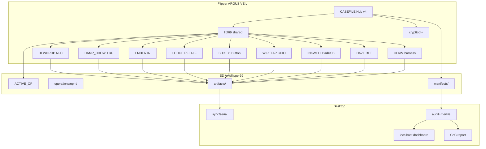

# Fl1pp3r69 v4.0 — Vision & Design Specification

**Codename:** **ARGUS VEIL**  
**Tagline:** *The dolphin grew teeth. The veil still holds. Argus opens every eye.*  
**Classification:** UNCLASSIFIED // FIELD RESEARCH ONLY  
**Baseline:** v3.0.0 VEIL LEDGER  
**Target:** v4.0.0  
**Date:** 2026-07-11  
**Companion audit:** [`docs/AUDIT-v3.md`](AUDIT-v3.md)

---

## 0. Codename justification

### ARGUS VEIL

| Element | Meaning |
|---------|---------|
| **Argus** | Panoptes — many eyes. Full legitimate Flipper domain coverage (RF, NFC, LF, IR, iButton, GPIO, BadUSB, BLE) under one instrument. |
| **Veil** | Continuity from **VEIL LEDGER**: OPSEC defaults, deliberate exfil, classification, panic metadata wipe. |
| **Why not OMNIS/AETHER/WYRM** | “Omnis” is vague; “Aether” is soft for CoC reports; “Wyrm” reads offensive. Argus is **observational**, not predatory — matches ethics. |
| **Release line** | `FL1PP3R69 // ARGUS VEIL // v4.0.0` |

**Positioning upgrade:**  
v3 = excellent structured capture + ledger.  
v4 = **the organized field operations platform** for everything the Flipper may legitimately do — still forensic, still ethical, still air-gap capable.

---

## 1. Executive vision

### 1.1 Mission (unchanged spine)

Fl1pp3r69 is a **manifest-driven, chain-of-custody field instrument** for authorized physical-layer research on owned/authorized systems. It turns ad-hoc Flipper usage into **CASEFILE operations**: phased, hashed, recoverable, reportable.

### 1.2 v4 thesis

> **Any legitimate action the hardware + Momentum base can perform must be claimable into a CASEFILE — with identity, phase, hash, and timeline — without becoming exploit soup.**

Implementation strategy:

1. **Stock harness first** — claim files from stock apps into ops (Sub-GHz, IR, RFID, etc.).  
2. **Deep probes second** — where Fl1pp3r69 adds custody UX (DEWDROP model).  
3. **Desktop workbench** — analysis, visualization, multi-op campaigns, CoC packages.  
4. **Shared libf69** — kill integration drift.

### 1.3 Target users

| User | v4 elevation |
|------|----------------|
| Solo researcher | Every domain one hub away; orphan attach; recovery solid at scale |
| Red team / physical pentest | Multi-protocol mission templates; operator ID; client CoC packs |
| Academic | Provenance, export formats, large-capture sealing on desktop |
| Investigator | Tamper-evident close, redaction, retention tooling |
| Compliance | ROE object, auth gates, share-safe defaults |
| Contributor | Scaffold + plugin registry + CI |

### 1.4 Non-negotiables

1. Manifest everything (or explicitly mark *unsealed* orphans).  
2. Staged ops only — no free-floating “god mode” menu.  
3. Zero exploits / jamming / region bypass / ungated bruteforce.  
4. Deliberate exfil (manual).  
5. OPSEC defaults + two-step panic (metadata only).  
6. Fail closed on integrity errors.  
7. Air-gapped desktop must fully work.  
8. User bears legal/ethical responsibility.

---

## 2. High-level architecture

### 2.1 Three layers (evolved)

```
┌─────────────────────────────────────────────────────────────┐
│  L0  MOMENTUM BASE (+ optional Fl1pp3r69 overlay)           │
│  Stock domain apps · radio stacks · theme · OPSEC patches   │
└───────────────────────────────┬─────────────────────────────┘
                                │
┌───────────────────────────────▼─────────────────────────────┐
│  L1  FAP SUITE v4 — ARGUS VEIL                              │
│  CASEFILE Hub · libf69 · domain probes · harness · crypttool│
│  ACTIVE_OP · CHECKPOINT · claim · auth gates                │
└───────────────────────────────┬─────────────────────────────┘
                                │ deliberate SD / USB
┌───────────────────────────────▼─────────────────────────────┐
│  L2  DESKTOP WORKBENCH — flipper69 v2                       │
│  CLI · Textual TUI · local web (127.0.0.1) · vault · CoC    │
│  chunked Merkle seal · migrate · export · multi-vault       │
└─────────────────────────────────────────────────────────────┘
```

### 2.2 Component interaction



### 2.3 On-device vs desktop labor

| Concern | On-device | Desktop |
|---------|----------|---------|
| Create/resume op | ✓ | Template scaffold |
| Capture / TX (gated) | ✓ | — |
| Claim stock files | ✓ | Bulk claim |
| VERIFY ≤N files | ✓ streaming/chunked | ✓ full |
| Merkle root / large seal | Leaf list | Tree + root |
| Protocol decode viz | Minimal labels | Full viewers |
| Reports / redaction | Status only | HTML/PDF/pack |
| Operator signing | Optional short ID | Keys, verify |
| Search multi-op vault | Last 24 ops | Entire vault |
| Serial exfil stream | Optional | Python listener |

### 2.4 Division rule

**If it needs radio/GPIO/NFC silicon → device.**  
**If it needs RAM, charts, PDF, multi-GB vault → desktop.**  
**If it is ethics/OPSEC → both, defaults on device.**

---

## 3. Unified CASEFILE v4 model

### 3.1 Storage layout

```
/ext/flipper69/
  index.json                 # schemaVersion 4
  ACTIVE_OP.json
  operators.json             # optional local operator roster (no secrets)
  templates/                 # optional on-device checklist JSON
  operations/
    op-YYYYMMDD-slug-hex/
      OPERATION.json
      CHECKPOINT.json
      ROE.json                # NEW optional rules of engagement snapshot
      TIMELINE.jsonl
      notes.txt
      manifests/
        CASEFILE-MANIFEST.json      # current seal (or pointer)
        CASEFILE-MANIFEST.prev.json # last seal body (chainPrev source)
        MERKLE.json                 # optional desktop/backfill
      artifacts/
        nfc/  subghz/  rfid/  ir/  ibutton/  gpio/  badusb/  ble/  field/  links/
      scripts/               # hash-listed BadUSB only
      claims/                # claim receipts from stock paths
```

**Migration:** v3 `captures/` remains readable; v4 writer prefers `artifacts/<domain>/` and accepts legacy `captures/` as alias.

### 3.2 Artifact taxonomy

| `artifactClass` | Examples | Sealed? |
|-----------------|----------|---------|
| `raw` | `.sub` `.nfc` `.rfid` `.ir` `.ibtn` logic bin | Yes |
| `meta` | `*.meta.json` sidecars | Yes |
| `script` | BadUSB payload in `scripts/` | Yes pre-exec |
| `note` | notes, operator comments | Yes |
| `derived` | desktop decode JSON | Desktop seal |
| `link` | pointer to external path + hash | Yes |
| `claim` | stock-app import receipt | Yes |
| `evidence_photo` | expansion camera import | Desktop-heavy |

### 3.3 Manifest system v4

**Goals:** scale past 24 files; remain device-verifiable for typical ops; desktop handles mega-ops.

#### Modes

| Mode | Where | Behavior |
|------|-------|----------|
| `inline` | Device default | Items array (raise soft cap to **64**, warn at 48) |
| `chunked` | Device large op | `manifests/parts/part-NN.json` + root list of part hashes |
| `merkle` | Desktop seal | Binary tree over chunk hashes; root in OPERATION |

#### chain model

```
chainPrev  → SHA-256 of previous full manifest document
merkleRoot → optional; set on desktop mega-seal or on-device if computed
operatorId → optional short id from operators.json
sealAlg    → "sha256" | "sha256-merkle-v1"
```

### 3.4 Phase engine v4

**Spine preserved:**

```
INTAKE → OP_PREP → PROBE → CAPTURE → VERIFY → EXFIL → CLOSE
```

**Extensions (non-breaking):**

| Extension | Description |
|-----------|-------------|
| `phaseHints[]` | Per-op checklist from template |
| `domainFocus[]` | Expected probes (`nfc`,`subghz`,…) |
| `gates` | e.g. `require_capture_before_verify`, `require_auth_for_tx` |
| `customSteps[]` | Optional labeled substeps logged to timeline (not new phase enums) |
| Sessions | `sessions[]` array with open/close timestamps |

**Anti-auto-crime rule:** No phase auto-runs TX. Auto phase advance never enables inject/replay without auth gate.

### 3.5 Op types v4

| Type | v3 | v4 notes |
|------|----|----------|
| proximity | ✓ | + multi-domain proximity pack |
| survey | ✓ | + BLE/RF/IR passive matrix |
| replay | ✓ | Auth gate hardened |
| inject | ✓ | BadUSB/GPIO only |
| unified | ✓ | Default multi-domain |
| **lab** | NEW | Explicit lab sandbox profile |
| **engagement** | NEW | Client ROE required fields |

---

## 4. Modular probe / plugin architecture

### 4.1 libf69 (new shared sources)

Path: `fap/libf69/` (compiled into each FAP or as static amalgamation):

- `f69_active_op_*` resolve  
- `f69_artifact_write_meta`  
- `f69_timeline_event`  
- `f69_auth_gate` (dual confirm patterns)  
- `f69_claim_from_path`  
- `f69_paths` constants  

### 4.2 Plugin contract v4

Extend `probe.plugin.json`:

- `artifactClasses[]`  
- `stockPaths[]` — directories the claim harness may import  
- `txCapable` + `requiresRegionalCompliance`  
- `minHubVersion`  
- `capabilities: ["read","write","emulate","survey","script"]`  
- ethics block unchanged (`noExploits: true` const)

**Still no dynamic code loading on device.** Plugins = reviewed FAPs + descriptors.

### 4.3 Claim harness (critical v4 feature)

**Codename:** **REAPER** (claim only — not destructive).  
Or softer: **INTAKE_CLAIM** in hub menu.

Flow:

1. Operator runs stock Sub-GHz/IR/RFID app → file in `/ext/subghz` etc.  
2. CASEFILE → **[CLAIM ARTIFACT]** → pick recent file → copy+hash into `artifacts/<domain>/` + claim receipt + timeline.  
3. VERIFY includes claimed file.

This single feature multiplies capability without reimplementing radio stacks.

---

## 5. Feature taxonomy (domains)

For each: **integration · artifacts · desktop · why cool+organized**.

### 5.1 Sub-GHz — DAMP_CROWD → **DAMP_CROWD Mk.II**

| Feature | Integration | Artifacts | Desktop | Why |
|---------|-------------|-----------|---------|-----|
| Band/session sidecar | CAPTURE phase | `.meta.json` | Band timeline | Continuity with v3 |
| Claim `.sub` from stock | CLAIM | raw + meta | Waveform/decode later | Full Momentum depth |
| Rolling-code **flag** only | meta `rollingSuspected` | meta | Highlight in report | Ethics-safe |
| Multi-freq session log | one op multi meta | session jsonl | Chart | Survey ops |
| Regional TX gate banner | before any TX claim | timeline | — | Compliance |
| Protocol label dictionary | meta enum | meta | Filter vault | Organization |
| Anomaly note field | operator text | meta | Search | Human intel |

**Not included:** jammer packs, fixed-code mass bruteforce, region unlock.

### 5.2 NFC — DEWDROP → **DEWDROP Mk.II**

| Feature | Integration | Artifacts | Desktop | Why |
|---------|-------------|-----------|---------|-----|
| Read/write/emulate (existing) | probe | `.nfc` + meta | Tag browser | Custody |
| ACTIVE_OP fix | all writes | — | — | Integrity |
| Ownership gate UX++ | write/emulate | timeline auth | CoC section | Ethics |
| UID-only vs full dump class | meta | classification | Report clarity | Professionalism |
| Multi-tag session tray | captures list | index | Grid | Field speed |
| Secure element “unsupported” honesty | UI | note | — | No false claims |

### 5.3 LF RFID — new **LODGE**

| Feature | Integration | Artifacts | Desktop | Why |
|---------|-------------|-----------|---------|-----|
| Read/claim/emulate owned fobs | probe + claim | `.rfid` + meta | Type ID | Completes access-control story |
| Auth gate on write | inject/proximity | timeline | — | Ethics |

### 5.4 Infrared — EMBER_TRACE → **EMBER_TRACE Mk.II**

| Feature | Integration | Artifacts | Desktop | Why |
|---------|-------------|-----------|---------|-----|
| Claim `.ir` | CLAIM | raw+meta | Library index | Depth via stock |
| Protocol sidecar | probe | meta | — | Continuity |
| Universal remote ref as link | link artifact | hash of pack file | — | Reproducibility |
| TX only after auth + owned device note | gate | timeline | — | Ethics |

### 5.5 iButton — new **BITKEY**

| Feature | Integration | Artifacts | Desktop | Why |
|---------|-------------|-----------|---------|-----|
| Read/write/emulate + meta | probe | `.ibtn` | Inventory | Physical key custody |
| Lab-only write default | op type lab/proximity | — | — | Safety |

### 5.6 GPIO / logic — new **WIRETAP** (lab name; not covert crime tool)

| Feature | Integration | Artifacts | Desktop | Why |
|---------|-------------|-----------|---------|-----|
| Pin session log | probe | `.gpio.jsonl` | Plotter | Lab instrumentation |
| Logic capture claim | CLAIM | bin + meta | Viewer | Serious lab use |
| Scripted pin sequences | scripts hashed | script+log | — | Repeatable lab |

Naming note: public docs may brand as **GPIO LAB** if “WIRETAP” is too spicy; internal codename can remain.

### 5.7 BadUSB — new **INKWELL**

| Feature | Integration | Artifacts | Desktop | Why |
|---------|-------------|-----------|---------|-----|
| Scripts only from `op/scripts/` | inject type | script | Template lib | Control |
| Hash before run | VERIFY script first | timeline | — | Integrity |
| Dual confirm + AUTHORIZED | gate | timeline | CoC | Ethics |
| Result log | capture | log | Report | Audit |

**No** credential-stealer packs in repo. Empty ethical templates only.

### 5.8 BLE — new **HAZE** (passive-first)

| Feature | Integration | Artifacts | Desktop | Why |
|---------|-------------|-----------|---------|-----|
| Passive survey (adv meta) | survey op | `.ble.jsonl` | Map/filter | Modern physical |
| Active only if plugin flags + auth | gate | meta | — | Legal variance |
| No spam/flood features | ban list | — | — | Ethics |

### 5.9 Cross-domain orchestration

| Feature | Description |
|---------|-------------|
| **Mission templates** | Multi-probe checklists (building: RF+IR+NFC+BLE) |
| **Linked captures** | `linkGroupId` in meta binding related artifacts |
| **Campaign ops** | Desktop groups multiple opIds under `campaignId` |
| **Sequence recipes** | Logged checklist only on-device; no silent TX macros |
| **Favorites / quick actions** | Hub shortcuts to claim / verify / dewdrop |

### 5.10 On-device power features

| Feature | Notes |
|---------|-------|
| Probe matrix screen | Launch domain probes from hub |
| Search ops by codename | Scroll filter |
| crypttool+ | chainPrev, item count, short hash, orphan hint |
| SD free % warning | Before claim |
| Capture counter HUD | Footer live |
| Pathnum + ROE badge | Engagement ops |
| Quick CLAIM last file | One-button from known stock dirs |

### 5.11 Desktop workbench (`flipper69` v2)

| Surface | Commands / features |
|---------|---------------------|
| CLI | `sync` (SD+serial), `audit`, `seal` (merkle), `report`, `pack`, `migrate`, `template`, `claim-import`, `export`, `vault`, `operator`, `dashboard` |
| TUI | Textual: vault browser, timeline, audit diff |
| Web | `flipper69 dashboard --bind 127.0.0.1` — timeline, graphs, report preview (**no remote bind default**) |
| Export | JSONL SIEM, CSV inventory, optional PCAP-ish wrappers where meaningful, HTML/PDF |
| Crypto | Opt-in vault age/gpg; operator sign manifests |
| Multi-vault | `FLIPPER69_OPS_ROOT` + named profiles |
| Analysis | NFC UID tables, Sub-GHz meta filters, BLE survey charts |

Example CLI surface:

```bash
flipper69 sync --sd E:\
flipper69 sync --serial auto
flipper69 audit --deep --merkle
flipper69 seal op-... --merkle
flipper69 report op-... --format html,pdf --redact-pii
flipper69 pack op-... --mode share-safe
flipper69 export op-... --fmt siem-jsonl
flipper69 dashboard
flipper69 migrate --from 3 --to 4
flipper69 scaffold probe rfid --codename LODGE
```

### 5.12 Security / OPSEC / compliance

| Feature | Detail |
|---------|--------|
| ROE.json | Scope, engagement ID, authorized systems summary (no secrets) |
| Operator ID | Local roster; optional signed seal |
| Granular OPSEC | BT/LED/name policies logged |
| Retention | `retention.json` + desktop warn/delete-with-confirm |
| Share-safe pack v2 | Class-based redaction policy file |
| Auth gate library | Shared dual-confirm patterns |
| TX audit log | Timeline events for any transmit claim |

### 5.13 Resilience / polish

| Feature | Detail |
|---------|--------|
| Streaming hash | 1 file at a time; progress toast |
| Chunked manifest | >64 items |
| Atomic write | write temp → rename for JSON seals |
| CHECKPOINT fsync | Best-effort |
| Corrupt ACTIVE_OP | Fall back + timeline warn |
| Large TIMELINE | Desktop compact copy; device append-only |
| i18n | English first; string tables later |

### 5.14 UI / identity

- Obsidian `#0a0a0c`, blood `#c41e1e`, phosphor `#39ff14`, amber `#ffb000`.  
- Phase rail + **domain dots** (N/R/I/L/G/B…).  
- Argus eye motif subtle in splash (not cartoon).  
- Accessibility: high-contrast mode option in theme pack.  

### 5.15 Features requiring Momentum / upstream changes

| Feature | Requirement |
|---------|-------------|
| Boot → CASEFILE autostart | Overlay patch (optional) |
| Global OPSEC defaults | Overlay / settings patch |
| Deep serial service in firmware | Overlay P4 (optional; FAP+desktop SD path primary) |
| Theme pack on device | Asset packaging |
| WiFi board integration | Expansion firmware + desktop import (not core FAP) |

**FAP-only path remains primary supported install.**

---

## 6. Schema drafts (v4)

Canonical drafts: `schemas/v4/`.

### 6.1 OPERATION.json (additions)

```json
{
  "schemaVersion": 4,
  "opId": "op-20260711-argus-demo",
  "releaseCodename": "ARGUS VEIL",
  "opType": "engagement",
  "domainFocus": ["nfc", "subghz", "ir", "ble"],
  "session": 1,
  "sessions": [{"id": 1, "openedAt": "...", "closedAt": null}],
  "operatorId": "optr-alpha",
  "campaignId": null,
  "templateId": "client-pentest-physical",
  "roePath": "ROE.json",
  "artifactRoot": "artifacts",
  "seal": {
    "alg": "sha256",
    "manifestPath": "manifests/CASEFILE-MANIFEST.json",
    "merkleRoot": null,
    "itemCount": 0
  },
  "gates": {
    "requireAuthForTx": true,
    "requireCaptureBeforeVerify": true
  },
  "permissions": {
    "opsec": true,
    "authorized": false,
    "txEnabled": false,
    "replayConfirmed": false
  }
}
```

### 6.2 Manifest item (additions)

```json
{
  "type": "capture",
  "artifactClass": "raw",
  "domain": "subghz",
  "path": "artifacts/subghz/door_433.sub",
  "hash": "...",
  "sizeBytes": 1200,
  "probe": "dampcrowd",
  "claimedFrom": "/ext/subghz/door_433.sub",
  "linkGroupId": "grp-access-01",
  "labels": ["rolling_suspected", "exterior"]
}
```

### 6.3 Compatibility

- Readers accept schemaVersion 2–4.  
- Writers emit 4.  
- `captures/` aliased to `artifacts/field/` for old ops.  
- `flipper69 migrate --to 4` rewrites paths optionally (copy, not destroy).

---

## 7. Major FAP specifications (high level)

| App ID | Codename | Role | Priority |
|--------|----------|------|----------|
| `flipper69_casefile_ops` | CASEFILE Hub v4 | Phases, claim, probe matrix, ROE badge | P0 |
| `flipper69_lib` sources | libf69 | Shared | P0 |
| `flipper69_probe_nfc` | DEWDROP Mk.II | NFC custody | P0 |
| `flipper69_probe_subghz` | DAMP_CROWD Mk.II | RF meta + claim assist | P0 |
| `flipper69_probe_ir` | EMBER Mk.II | IR meta + claim | P0 |
| `flipper69_harness` | CLAIM | Stock path importer | P0 |
| `flipper69_manifest_viewer` | crypttool+ | Seal browser | P0 |
| `flipper69_probe_rfid` | LODGE | LF RFID | P1 |
| `flipper69_probe_ibutton` | BITKEY | iButton | P1 |
| `flipper69_probe_badusb` | INKWELL | Gated scripts | P1 |
| `flipper69_probe_gpio` | GPIO LAB | Lab GPIO | P1 |
| `flipper69_probe_ble` | HAZE | Passive BLE survey | P1 |

---

## 8. Example workflows

### 8.1 Multi-protocol physical access assessment

1. Template `client-pentest-physical` → engagement op + ROE.  
2. OPSEC on; PATHNUM `imps`.  
3. DEWDROP read owned/auth badges → artifacts/nfc.  
4. Stock Sub-GHz capture gate remote → CLAIM.  
5. LODGE LF fob → artifacts/rfid.  
6. VERIFY (chunked if needed) → EXFIL SD → desktop report for client.

### 8.2 Building survey (RF + IR + NFC + BLE)

1. Template survey-building.  
2. HAZE passive walkthrough.  
3. DAMP_CROWD session metas per floor.  
4. EMBER claim HVAC remotes.  
5. Desktop dashboard: timeline map by floor labels in notes.

### 8.3 Academic RF campaign

1. Template academic-rf-capture.  
2. Multi-day sessions on same opId.  
3. Desktop merkle seal for publication appendix.  
4. Export SIEM-jsonl for lab notebook pipeline.

### 8.4 Lab BadUSB + GPIO instrument day

1. Op type `lab`.  
2. INKWELL hash script → dual confirm → run → log.  
3. GPIO LAB pin log.  
4. Full VERIFY + pack for lab archive.

### 8.5 Power-loss mid-claim

1. CHECKPOINT after each claim.  
2. Resume ACTIVE_OP.  
3. Orphan scan → attach incomplete → re-VERIFY.

---

## 9. Implementation roadmap

### Phase A — v4.0 MVP (Definition of Done)

**Done when:**

1. libf69 shared; **all probes use ACTIVE_OP**.  
2. CLAIM harness imports from stock Sub-GHz/IR/NFC paths into `artifacts/`.  
3. Manifest **inline cap ≥ 64** + **chunked** mode for larger.  
4. schemaVersion 4 + migrate from 3.  
5. DEWDROP/DAMP/EMBER Mk.II meta consistency.  
6. Desktop: serial sync, deep audit, merkle seal, Textual TUI or localhost dashboard (at least one polished), report v2.  
7. crypttool+ shows chain + counts.  
8. CI: schemas v4 + desktop tests + example vault seal.  
9. Docs: DESIGN.md updated, OPS-DISCIPLINE v4, MIGRATION-v4.  
10. Zero new exploit surface; ethics gates on TX/write/script.  
11. Demo multi-domain example op in `examples/`.  

### Phase B — v4.1 domain pack

LODGE, BITKEY, INKWELL, HAZE passive, GPIO LAB.

### Phase C — v4.2 professional

Operator signing, vault encryption, campaign layer, export formats, retention tooling.

### Phase D — optional overlay

Autostart, theme bake-in, firmware serial service — never block FAP-only users.

---

## 10. Risks & scope control

| Risk | Mitigation |
|------|------------|
| Feature creep | Domain P0/P1/P2 gates; claim harness before new stacks |
| Unmaintainable probes | libf69 + scaffold + one meta schema |
| Ethics regression | Plugin schema consts + PR checklist + no TX macros |
| Hardware limits | Desktop merkle; device streaming hash |
| User confusion | Hub probe matrix + docs field cards |
| Dual path capture/ vs artifacts/ | Alias layer 1 major version |

**Scope creed:** *Cool is allowed only if it is claimable, hashable, and phaseable.*

---

## 11. Testing strategy

| Layer | Tests |
|-------|-------|
| Schemas | jsonschema CI for v3+v4 examples |
| libf69 | Host-side unit tests where extractable; device checklist |
| Desktop | pytest: migrate 3→4, chunked seal, claim-import fixture |
| Integration | examples/sd_card multi-domain vault |
| Field | HARDWARE-VALIDATION-v4 scenarios (power loss, claim, inject gate) |
| Ethics | Static grep CI for banned terms/paths (jam, bypass) in fap/ |

---

## 12. Proposed directory structure (additions)

```
fap/
  libf69/                 # NEW shared C
  harness_claim/          # NEW CLAIM FAP or hub-integrated
  probe_rfid/
  probe_ibutton/
  probe_badusb/
  probe_gpio/
  probe_ble/
desktop/flipper69/
  serial.py
  seal.py
  dashboard/
  export/
  scaffold.py
schemas/v4/
  operation.schema.json
  manifest.schema.json
  artifact.schema.json
  roe.schema.json
docs/
  AUDIT-v3.md
  VISION-v4.md
  MIGRATION-v4.md         # when implementing
examples/templates/v4/
examples/campaigns/
```

---

## 13. Next steps (build order)

1. **Land audit + this vision** in repo (docs only).  
2. **Extract libf69** + fix DEWDROP/DAMP ACTIVE_OP (quick win).  
3. **CLAIM harness** (highest capability-per-LOC).  
4. **schemaVersion 4 + migrate + raise manifest caps / chunking**.  
5. **Desktop serial + seal --merkle + dashboard/TUI**.  
6. **Domain pack FAPs** one per release train.  
7. Hardware validation pass; rebuild all FAPs; hygiene commit; tag v4.0.0.  

**Team shape:** 1 embedded lead (FAPs/lib), 1 desktop lead (workbench), part-time docs/ethics reviewer. Solo is viable if claim+lib ship first.

---

*The dolphin grew teeth. The veil still holds. Argus opens every eye — and every eye still writes the ledger.*
